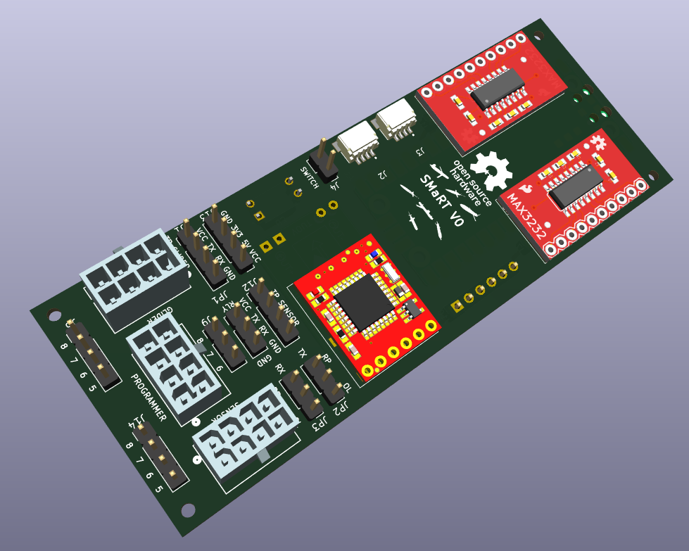
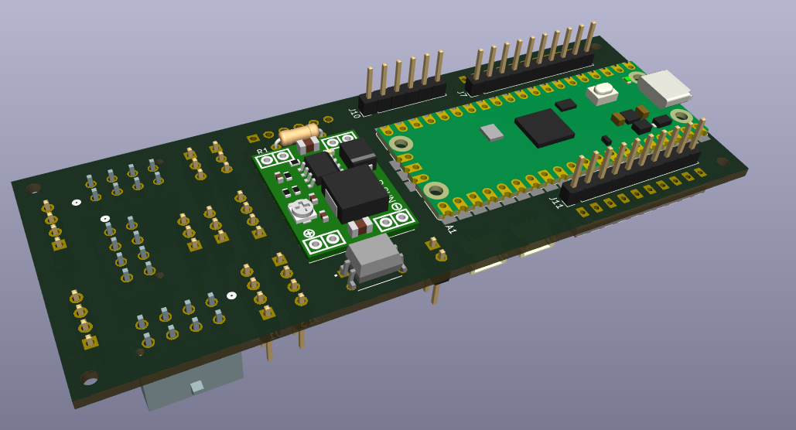

# SMaRT
Sensor Management and Relay Tool

This tool is designed to fascillitate easier sensor integration on gliders.
The idea here is to use a have a mainboard hosting popular and easy to source modules in order to have a man-in-the-middle board which is needed for special sensor integration or to fully use the capabilities of the Slocum BackSeatDriver without the need for using power hungry such as raspverry pi or other single board computers.

**Hardware**

- the brain is a RP2040 board (pi pico)
- the RS232 transcievers are sparkfun max3232
- DCDC converter is the popular MP1584 module
- (optional) openlog for using this board as a datalogger
- (optional) Solid State Relay for independant sensor power control
- Connectors:
	- Molex connectors compatible with the ones used in Slocum Science Computer
	- 2.54mm pitch footprints for most other connectors so either simple headers or other locking connectors such as JST-XH series can be used
	- 2 x Qwiic connectors for connecting external sensor modules

Also the form factor is just small enough to fit inside a 1000m rated 2"x150mm Bluerobotics housing so it could be used as an external interface as was the original idea. Or possibly can be used as a simple logger with a single end connection to a sensor.

**Firmware**

The current firmware is a work-in-progress UVP6 integration on Slocum only. The plan is to make the firmware more generic and applicable to both Seaglider and Slocum.
